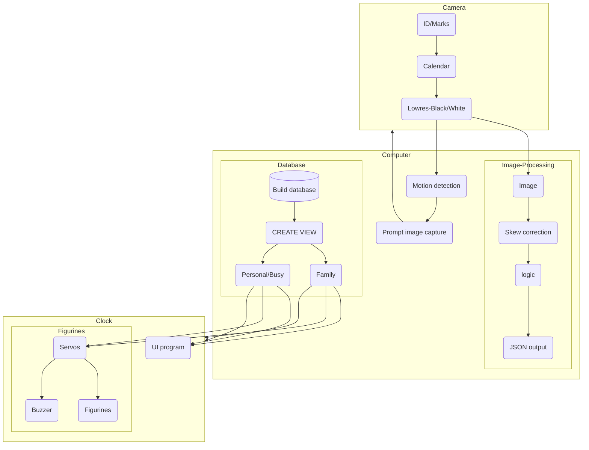

```mermaid
flowchart TB
	subgraph Camera
		direction TB
		id1.1(Lowres-Black/White)
		id1.2(Calendar)
		id1.3(ID/Marks)
		
		id1.2 --> id1.1
		id1.3 --> id1.2
	end
	subgraph Computer
		direction LR
		id2.1(Motion detection)
		id2.2(Prompt image capture)
		
		id2.1 --> id2.2
		subgraph Image-Processing
			direction TB
			id3.1(Image)
			id3.2(Skew correction)
			id3.3(logic)
			id3.4(JSON output)
			
			id3.1 --> id3.2
			id3.2 --> id3.3
			id3.3 --> id3.4
		end
		subgraph Database
			direction TB
			id4.1[(Build database)]
			id4.2(CREATE VIEW)
			id4.3(Family)
			id4.4(Personal/Busy)
			
			id4.1 --> id4.2
			id4.2 --> id4.3 & id4.4
		end
	end
	subgraph Clock
		direction TB
		id5.1(UI program)
		subgraph Figurines
			id6.1(Servos)
			id6.2(Figurines)
			id6.3(Buzzer)
			
			id6.1 --> id6.2 & id6.3
		end
	end
	
	id1.1 --> id3.1
	id1.1 --> id2.1
	id2.2 --> Camera
	
	id4.3 --> Clock & id5.1 & id6.1
	id4.4 --> Clock & id5.1 & id6.1
```
