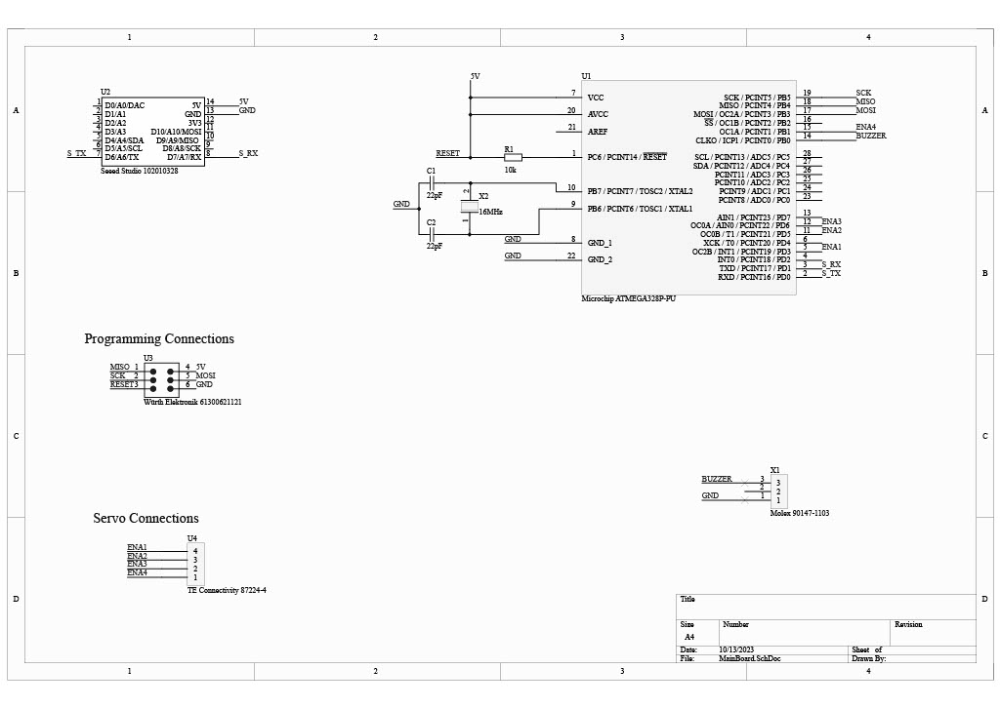

# Microcontroller

## Microcontroller Circuitry
### Required Components
#### Physical Layout Components
- 1 x Atmega 328P Microcontroller flashed with Arduino Uno Bootloader
- 1 x 16MHz Crystal Oscillator
- 1 x Seeeduino Xiao
- 1 x Piezzo Buzzer
- 4 x 5010G 180 degree Servo motor
- 2 x 22pF ceramic capacitors, through hole
- 1 x 1000uF electrolytic capacitor
- 2 x Breadboards with dual power rails
- 1 x 4 AA Battery holder, plastic
- 1 x 2 Way PCB mount Screw terminals, 5mm Pitch

#### Programming Components
- 1 x Duinotech ISP Programmer for Arduino and AVR
- 1 x Duinotech Arduino Compatible AVR ISP 10pin to 6pin Adaptor

## Circuit Layout

## Programming the microcontroller
The Atmega328P microcontroller will already come flashed with code to run this project. However if you are interested in flashing the controller, follow the below steps.
1. If you do not have the AVRDude or Zandig configuration files downloaded, follow the documentation instructions [here](https://www.jaycar.com.au/medias/sys_master/images/images/9963160993822/XC4627-manualMain.pdf) with any mentions to the software zip file being found [here](https://www.jaycar.com.au/duinotech-isp-programmer-for-arduino-and-avr/p/XC4627)
2. Connect the ISP programmer to computer and board per the layout circuit above
3. Open the atmega328p_lambda_mc.ino file in Arduino IDE
4. Verify the code file
5. Under the Sketch tab, click export compiled binary
6. In the AVRDude GUI, select the atmega328p_lambda_mc folder as the directory and select the binary export file to upload
7. Click the upload button and wait for the upload sequence to finish